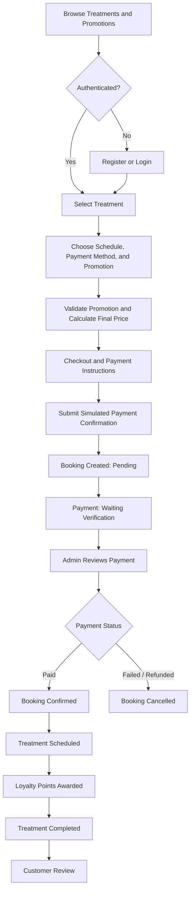
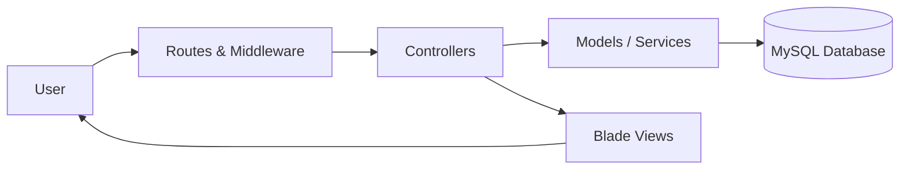

<div align="center">

# Lumiere Beauty

### Beauty Treatment Booking & Management System

A web-based beauty treatment booking and management system developed with Laravel to support treatment discovery, online booking, promotional discounts, simulated payments, membership, loyalty points, reviews, and administrative management.

**Academic Project — Web Programming**

<br>


</div>

---

## Overview

**Lumiere Beauty** is a web-based beauty treatment booking and management system developed as a group academic project for the **Web Programming** course in the Information Systems program at Universitas Esa Unggul.

The application integrates treatment discovery, online booking and scheduling, promotional discounts, simulated payments, membership and loyalty points, customer reviews, and administrative management within a Laravel-based information system.

The system supports three main access levels: **Guest, Customer, and Administrator**.

---

## My Contribution

My primary responsibilities in this project were **Home Page Development, Interface Integration, and Hosting & Deployment**.

### Main Contributions

* Developed and refined the main customer-facing Home Page.
* Integrated featured treatments and active promotions from the database.
* Integrated reusable layout components including navigation and footer.
* Implemented authentication-aware and role-aware navigation.
* Maintained visual consistency and responsive behavior across application pages.
* Integrated Bootstrap, custom CSS, JavaScript, and Vite assets.
* Prepared the Laravel application for production hosting.
* Managed deployment through DomaiNesia and cPanel.
* Configured the production database, application structure, domain, DNS, and SSL/HTTPS.

### Main Files

```text
app/Http/Controllers/HomeController.php

resources/views/home.blade.php
resources/views/layouts/app.blade.php
resources/views/partials/navbar.blade.php
resources/views/partials/footer.blade.php

public/assets/css/styles.css
public/assets/js/script.js

resources/css/app.css
resources/js/app.js
vite.config.js
```

---

## Key Features

* **Authentication & Role-Based Access** — Customer and administrator authentication with protected routes and role-specific navigation.
* **Treatment Catalogue** — Browse, search, and filter available beauty treatments.
* **Online Booking** — Select treatment, booking date, booking time, payment method, and optional promotion code.
* **Promotion System** — Validates promotion period, treatment eligibility, and membership requirements before automatically calculating discounts.
* **Simulated Payment** — Supports QRIS, bank transfer, e-wallet, and cash workflows for academic demonstration.
* **Booking Tracking** — Customers can monitor payment, booking, and treatment statuses.
* **Membership & Loyalty Points** — Tracks membership levels, active points, and point transaction history.
* **Payment Receipt** — Customers can access receipts for eligible verified bookings.
* **Customer Reviews** — Reviews can be submitted after treatment completion.
* **Admin Management** — Administrators can manage treatments, promotions, bookings, payment verification, and treatment statuses.

---

## Core Business Flow



---

## System Architecture

Lumiere Beauty follows Laravel's **Model-View-Controller (MVC)** architecture.



The architecture separates request handling, application logic, data management, and interface presentation into structured components.

---

## Technology Stack

| Category             | Technology            |
| -------------------- | --------------------- |
| Backend Framework    | Laravel 10            |
| Programming Language | PHP 8.1+              |
| Frontend Template    | Laravel Blade         |
| Frontend             | HTML, CSS, JavaScript |
| UI Framework         | Bootstrap 5.3         |
| Database             | MySQL                 |
| ORM                  | Laravel Eloquent      |
| Build Tool           | Vite                  |
| Package Management   | Composer, NPM         |
| Local Development    | XAMPP                 |
| Version Control      | Git & GitHub          |
| Deployment           | DomaiNesia / cPanel   |

---

## Screenshots

### Home Page

The homepage serves as the main entry point and integrates treatment highlights, promotions, membership information, navigation, and authentication-aware actions.

<p align="center">
  
</p>

### Treatment Booking

Customers can select a treatment, booking date, booking time, payment method, promotion code, and additional booking information.

<p align="center">
  
</p>

### Payment and Promotion

The checkout workflow displays the original treatment price, applied promotion, discount amount, and final payment total before simulated payment confirmation.

<p align="center">
  
</p>

### Customer Booking History

Customers can monitor reservations and review payment, booking, and treatment statuses.

<p align="center">
  
</p>

### Admin Dashboard

The administrative dashboard provides an overview of treatments, customers, bookings, payments, and other system information.

<p align="center">
  
</p>

### Booking Management

Administrators can search and filter bookings, verify payment information, and update payment, booking, and treatment statuses.

<p align="center">
  
</p>

---

## Getting Started

<details>
<summary>Local Installation</summary>

### Requirements

Make sure the following software is available:

* PHP 8.1 or later
* Composer
* MySQL
* Node.js and NPM
* Git

### 1. Clone Repository

```bash
git clone https://github.com/anggitasilmyy/lumiere-beauty.git
cd lumiere-beauty
```

### 2. Install Dependencies

```bash
composer install
npm install
```

### 3. Create Environment File

For Windows:

```bash
copy .env.example .env
```

For macOS or Linux:

```bash
cp .env.example .env
```

### 4. Generate Application Key

```bash
php artisan key:generate
```

### 5. Configure Database

Configure the local MySQL connection inside `.env`.

Example:

```env
DB_CONNECTION=mysql
DB_HOST=127.0.0.1
DB_PORT=3306
DB_DATABASE=lumiere_beauty
DB_USERNAME=root
DB_PASSWORD=
```

### 6. Run Database Migration

```bash
php artisan migrate
```

Optional demo data can be generated using the available project seeders.

### 7. Create Storage Link

```bash
php artisan storage:link
```

### 8. Run Frontend Development Server

```bash
npm run dev
```

### 9. Run Laravel Application

```bash
php artisan serve
```

The application will normally be available at:

```text
http://127.0.0.1:8000
```

</details>

---

## Project Limitations

<details>
<summary>Current Project Limitations</summary>

* Payment processing is simulated and is not connected to a real payment gateway.
* Treatment booking does not yet include schedule collision or capacity validation.
* Point redemption is not currently implemented.
* Contact information is currently static.
* Automated testing is still limited.

These limitations represent potential areas for future system development.

</details>

---

## Project Team

Lumiere Beauty was developed collaboratively as a group final project for the **Web Programming** course.

| Team Member             | Primary Contribution                                       |
| ----------------------- | ---------------------------------------------------------- |
| **Silmy Kaffa Anggita** | **Home Page, Interface Integration, Hosting & Deployment** |
| Neng Audy Agustin       | Treatments, Treatment Booking & Booking Flow               |
| Angellica Ivana         | Membership, Loyalty Points, Profile & Membership Levels    |
| Stefanie Sentana        | Promotions & Promotion Management                          |
| Nova Selvia             | Contact & Clinic Information                               |

Several cross-functional components were integrated collaboratively across the project, including authentication, administrative functionality, simulated payment, receipts, reviews, and project documentation.

---

## Project Note

This project was developed for academic and portfolio purposes.

The application was previously deployed to a temporary production hosting environment as part of the course evaluation process. The deployment was intended for academic assessment and is **not maintained as a permanent public live demo**.

All payment information used in this project is dummy data and no real financial transactions are processed.

---

## Repository Owner

**Silmy Kaffa Anggita**
Information Systems Student — Universitas Esa Unggul

[LinkedIn](https://www.linkedin.com/in/silmy-kaffa-anggita-1347a6322) | [GitHub](https://github.com/anggitasilmyy)

---

<div align="center">

### Lumiere Beauty

**Beauty Treatment Booking & Management System**

Academic Web Programming Project

</div>
