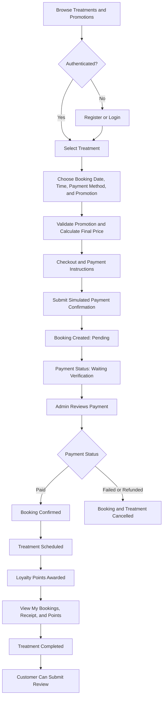
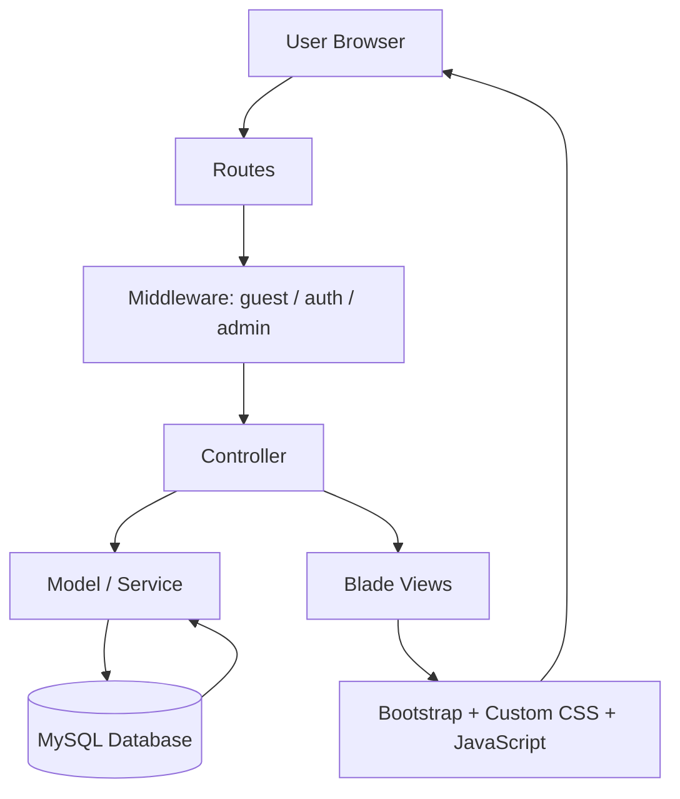
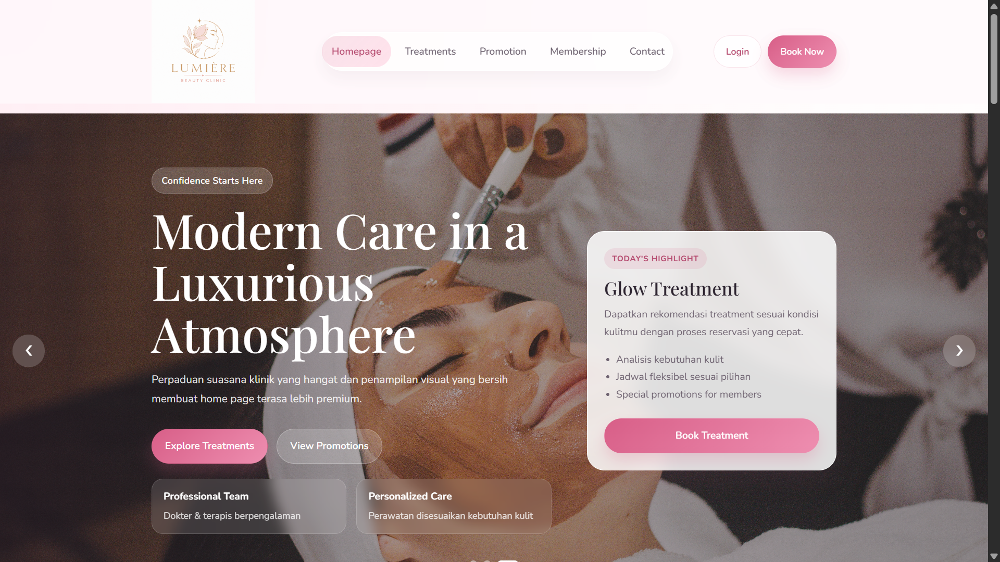
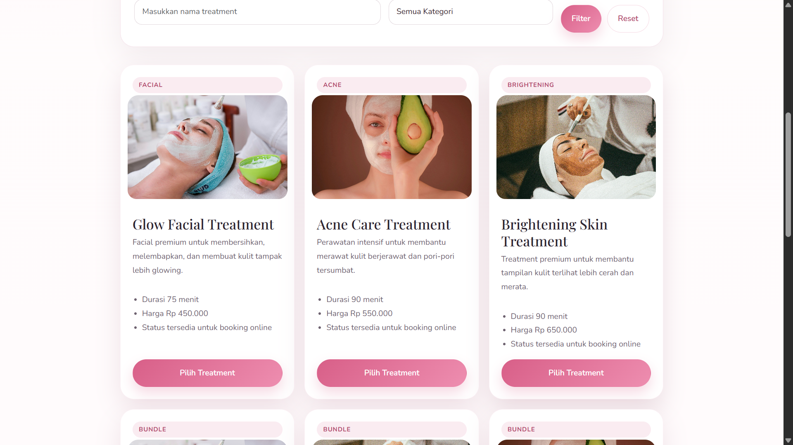
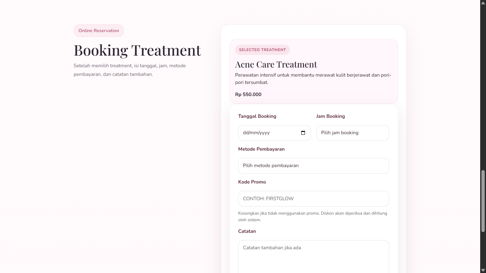
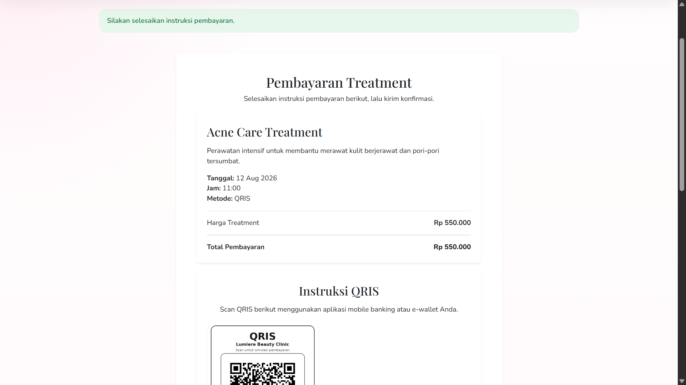
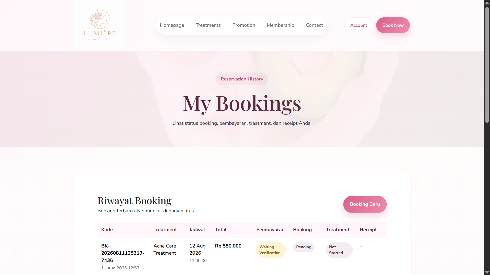
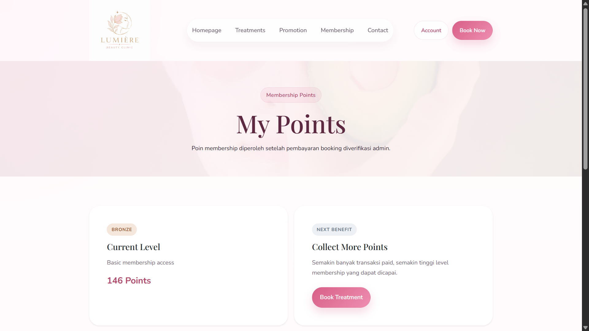
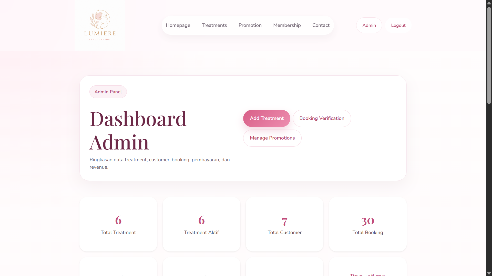
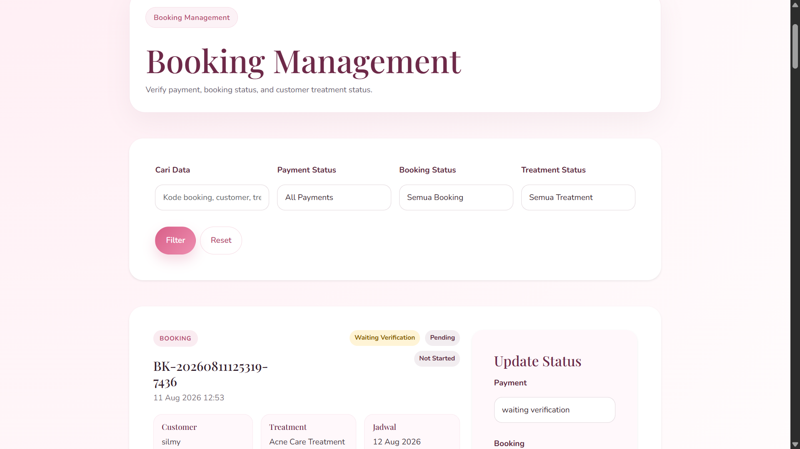

<div align="center">

# Lumiere Beauty

### Beauty Treatment Booking & Management System

A web-based beauty treatment booking and management system developed with Laravel to support treatment discovery, online booking, simulated payments, promotions, membership, loyalty points, reviews, and administrative management.

**Academic Project — Web Programming**

<br>


[Live Website](https://lumierebeauty.web.id) | [Repository](https://github.com/anggitasilmyy/lumiere-beauty)

</div>

---

## Overview

**Lumiere Beauty** is a web-based information system developed as an academic project for the **Web Programming** course.

The system was designed to digitalize the beauty treatment reservation process by providing a centralized platform where customers can explore treatments and promotions, create bookings, select schedules, complete a simulated payment process, monitor booking status, collect loyalty points, and submit reviews.

An administrative interface is also available for managing treatments, customer bookings, payment verification, treatment status, and promotions.

The project demonstrates the implementation of a complete Laravel-based information system that connects customer-facing features, administrative functionality, relational database management, and web deployment.

---

## Problem Background

Beauty service businesses require an organized process for managing treatment information, customer reservations, schedules, promotions, payments, and service records.

When these activities are handled separately or manually, customers may experience difficulties in:

- Finding available treatment information.
- Choosing appropriate treatment services.
- Arranging treatment schedules.
- Monitoring reservation and payment status.
- Accessing promotion and membership information.
- Reviewing previous bookings.

Lumiere Beauty was developed to demonstrate how a web-based information system can organize these activities into a more structured and integrated digital workflow.

---

## Project Objectives

The main objectives of this project are to:

- Provide accessible treatment and promotion information.
- Support an integrated treatment booking process.
- Allow customers to select treatment schedules and payment methods.
- Centralize booking and simulated payment information.
- Allow customers to monitor booking history and payment status.
- Implement membership and loyalty point features.
- Provide post-treatment review functionality.
- Provide administrative tools for managing treatments, bookings, payments, and promotions.
- Apply Laravel MVC, relational database, frontend development, and deployment concepts in a complete web application.

---

## My Contribution

My primary responsibilities in this project were **Home Page development, interface integration, and hosting & deployment**.

The main focus of my contribution was ensuring that the homepage functioned not only as an informational landing page, but also as an integration point between treatments, promotions, membership information, authentication states, navigation, and other system modules.

### Home Page Development

I worked on the main customer-facing homepage, including:

- Hero section and primary call-to-action elements.
- Treatment highlights.
- Promotion highlights.
- Membership information.
- Quick information sections.
- Homepage statistics display.
- Navigation to other system modules.
- Responsive page composition.

The homepage combines static presentation content with dynamic treatment and promotion data retrieved from the database.

### Dynamic Data Integration

The homepage integrates data through `HomeController`.

The controller retrieves:

- Up to **6 active and featured treatments**.
- Up to **3 active promotions** that are currently within their valid period.

These records are then passed to the Blade homepage and rendered dynamically.

### Interface Integration

I also worked on integrating reusable visual components across the application, including:

```text
resources/views/layouts/app.blade.php
resources/views/partials/navbar.blade.php
resources/views/partials/footer.blade.php
public/assets/css/styles.css
public/assets/js/script.js
```

This integration includes:

- Shared application layout.
- Responsive navigation.
- Authentication-aware navigation states.
- Customer and administrator navigation integration.
- Reusable navbar and footer.
- Bootstrap integration.
- Custom styling.
- Custom JavaScript interactions.
- Vite asset integration.

### Frontend Interaction

Custom JavaScript supports several interface interactions, including:

- Hero slider.
- Mobile hamburger navigation.
- Active navigation state.
- Counter animation.
- Reveal animation.
- Other homepage interactions.

### Hosting & Deployment

I was also responsible for the hosting and deployment process of Lumiere Beauty.

The deployment work included:

- Preparing the Laravel project for production hosting.
- Managing deployment through cPanel and DomaiNesia.
- Configuring the production database.
- Managing the Laravel project and `public_html` structure.
- Preparing production environment configuration.
- Building frontend assets using Vite.
- Configuring the application domain.
- Managing DNS configuration.
- Activating SSL/HTTPS.
- Verifying that production assets, routes, and database connections worked correctly.

The deployed application is available at:

**https://lumierebeauty.web.id**

### Main Files Related to My Contribution

```text
app/Http/Controllers/HomeController.php

resources/views/home.blade.php
resources/views/layouts/app.blade.php
resources/views/partials/navbar.blade.php
resources/views/partials/footer.blade.php

public/assets/css/styles.css
public/assets/js/script.js

resources/css/app.css
resources/js/app.js

vite.config.js
```

---

## User Roles

The system consists of three main user roles.

### Guest

Guests can:

- Access the homepage.
- Browse treatments.
- View promotions.
- View membership information.
- Access clinic information.
- Register for a customer account.
- Log in to an existing account.

Guests cannot create bookings or access customer and administrator data.

### Customer

Authenticated customers can:

- Browse treatments.
- Search and filter treatments.
- Select a treatment.
- Choose booking date and time.
- Select a payment method.
- Complete the simulated payment process.
- View personal booking history.
- Monitor payment and booking status.
- Access payment receipts for eligible bookings.
- View loyalty points.
- View membership information.
- Access profile information.
- Submit a review after treatment completion.

### Administrator

Administrators can:

- Access the administrative dashboard.
- Manage treatments.
- Activate or deactivate treatments.
- Manage customer bookings.
- Search and filter booking records.
- Verify simulated payments.
- Update payment status.
- Update booking status.
- Update treatment status.
- Manage promotions.

---

## Core Business Flow

The main business process connects the customer booking journey with administrative payment verification and post-transaction customer services.



### Flow Explanation

1. A user begins by exploring available treatments and promotions.
2. Authentication is required before creating a booking.
3. The customer selects a treatment, booking date, booking time, and payment method.
4. The checkout process temporarily stores the booking information before confirmation.
5. After simulated payment confirmation is submitted, the system creates the booking and payment records.
6. The booking begins with a `pending` status and the payment enters `waiting_verification`.
7. An administrator reviews the payment information.
8. When the payment is changed to `paid`, the booking is automatically confirmed.
9. The treatment status is automatically changed from `not_started` to `scheduled`.
10. Loyalty points are awarded to the customer.
11. The customer can access booking information, receipt, and loyalty point history.
12. After the treatment status becomes `completed`, the customer can submit a review.
13. If payment is marked as `failed` or `refunded`, the booking and treatment are cancelled.

---

## Key Features

### Authentication and Role-Based Access

The application supports:

- Customer registration.
- Customer and administrator login.
- Logout.
- Guest middleware.
- Authentication middleware.
- Administrator middleware.
- Role-based navigation and route protection.

### Treatment Catalogue

Customers can:

- Browse active treatments.
- Search available treatments.
- Filter treatments by category.
- View treatment information.
- Select a treatment for booking.

Administrators can manage treatment information through the administrative interface.

### Treatment Booking

Authenticated customers can:

- Select a treatment.
- Choose a booking date.
- Choose a booking time.
- Select a payment method.
- Add optional notes.
- Continue to payment instructions.

The temporary checkout process uses session data before the booking is permanently created.

### Simulated Payment

The system includes a simulated payment workflow for academic demonstration.

Supported payment options include:

- QRIS.
- Bank transfer.
- E-Wallet.
- Cash.

Before payment instructions are displayed, the system calculates the final booking amount based on the selected treatment and any eligible promotion.

After customer confirmation, the payment enters a `waiting_verification` state and must be reviewed by an administrator.

> No real payment gateway or real financial transaction is implemented in this project.

### Booking Management

Customers can access their own booking history.

Administrators can:

- Search bookings.
- Filter payment status.
- Filter booking status.
- Filter treatment status.
- Update booking information.
- Verify payment status.

### Payment Status Automation

When an administrator marks a payment as `paid`:

- A pending booking becomes `confirmed`.
- A `not_started` treatment becomes `scheduled`.
- Payment confirmation information is stored.
- A receipt code can be generated.
- Loyalty points are awarded.

When payment becomes `failed` or `refunded`:

- The booking becomes `cancelled`.
- The treatment becomes `cancelled`.

### Payment Receipt

Customers can access a receipt for eligible paid bookings.

Booking ownership is checked so that customers can only access their own booking information, while administrators can access administrative records.

### Membership and Loyalty Points

Customers can:

- View their current membership level.
- Monitor total active points.
- View point transaction history.
- Progress through membership levels.

The implemented membership levels are:

| Level | Minimum Active Points |
|---|---:|
| Bronze | 0 |
| Silver | 500 |
| Gold | 1,500 |
| Platinum | 3,000 |

Points generated from successful booking payments are calculated based on the booking value.

### Promotions

The system supports both public and membership-based promotional programs.

Customers can:

- View currently active promotions.
- Check available promo codes and discount percentages.
- Identify membership requirements for member-exclusive promotions.
- Apply eligible promotion codes during treatment booking.
- Automatically receive the corresponding discount during checkout.

The promotion workflow validates:

- Promotion activation status.
- Promotion validity period.
- Treatment eligibility.
- Customer membership eligibility.

When a valid promotion is applied, the system stores the promotion information, original treatment price, discount percentage, discount amount, and final booking total.

### Reviews

Customers can submit a booking review after the related treatment has reached the `completed` status.

The system stores ratings and review comments associated with supported reviewable objects.

### Administrative Dashboard

The administrator interface provides access to system information and management features including:

- Treatment management.
- Booking management.
- Payment verification.
- Treatment status management.
- Promotion management.
- Customer and booking summaries.

---

## System Architecture

Lumiere Beauty follows Laravel's **Model-View-Controller (MVC)** architecture.



### Request Lifecycle

A typical application request follows this process:

```text
Browser
   ->
Route
   ->
Middleware
   ->
Controller
   ->
Model / Service
   ->
MySQL Database
   ->
Controller
   ->
Blade View
   ->
Browser
```

This structure separates request handling, business logic, data management, and interface presentation.

---

## Technology Stack

| Category | Technology |
|---|---|
| Backend Framework | Laravel 10.10+ |
| Programming Language | PHP 8.1+ |
| Frontend Template | Laravel Blade |
| Frontend | HTML, CSS, JavaScript |
| UI Framework | Bootstrap 5.3 |
| Database | MySQL |
| ORM | Laravel Eloquent |
| Asset Build Tool | Vite 5 |
| Package Management | Composer, NPM |
| Local Development | XAMPP |
| Version Control | Git & GitHub |
| Hosting | DomaiNesia / cPanel |
| Deployment | Production domain with HTTPS |

---

## Main Application Structure

```text
lumiere-beauty/
|
|-- app/
|   |-- Http/
|   |   |-- Controllers/
|   |   |-- Middleware/
|   |
|   |-- Models/
|   |-- Services/
|
|-- database/
|   |-- migrations/
|   |-- seeders/
|
|-- resources/
|   |-- css/
|   |-- js/
|   |-- views/
|
|-- routes/
|   |-- web.php
|
|-- public/
|   |-- assets/
|
|-- storage/
|
|-- tests/
|
|-- composer.json
|-- package.json
|-- vite.config.js
|-- README.md
```

---

## Main Data Relationships

The system uses several relational database patterns.

| Relationship | Type |
|---|---|
| Membership Level to User | One-to-Many |
| User to Booking | One-to-Many |
| Treatment to Booking | One-to-Many |
| Booking to Payment | One-to-One |
| User to Point Transaction | One-to-Many |
| Booking to Point Transaction | One-to-Many |
| Promotion to Treatment | Many-to-Many |
| User to Role | Many-to-Many |
| Review to Reviewable Object | Polymorphic |

---

## Project Scope and Limitations

This project was created as an academic Web Programming project and is presented according to its implemented scope.

Current limitations include:

- Payment processing is simulated and is not connected to a real payment gateway.
- Treatment booking does not yet include schedule collision or capacity validation.
- Payment proof storage is prepared in the database but is not fully implemented in the current customer workflow.
- Point expiration is calculated during synchronization and does not currently use a daily scheduler.
- Point redemption is not yet implemented.
- Contact information is currently static and does not include a contact-message database workflow.
- Automated testing is still limited.

These limitations provide potential areas for future system development.

---

## Screenshots

The following screenshots demonstrate the main customer and administrative workflows implemented in Lumiere Beauty.

### Home Page

The homepage serves as the main entry point to the system and integrates navigation, treatment highlights, promotions, membership information, and authentication-aware actions.

<p align="center">
  
</p>

### Treatment Catalogue

Customers can browse available treatments, view treatment information, search or filter services, and select a treatment for booking.

<p align="center">
  
</p>

### Treatment Booking

After selecting a treatment, authenticated customers can choose their booking date, time, payment method, and provide additional booking information.

<p align="center">
  
</p>

### Simulated Payment and Promotion

The checkout workflow displays the original treatment price, applied promotion, discount amount, and final payment total before the customer submits the simulated payment confirmation.

<p align="center">
  
</p>

### My Bookings

Customers can monitor their reservation history and view payment, booking, and treatment statuses.

<p align="center">
  
</p>

### Membership and Loyalty Points

The membership feature displays the customer's current membership level, accumulated points, and progression toward the next membership benefit.

<p align="center">
  
</p>

### Admin Dashboard

The administrative dashboard provides an overview of treatments, customers, bookings, payments, and other system information.

<p align="center">
  
</p>

### Booking Management

Administrators can search and filter bookings, review payment statuses, and update payment, booking, and treatment statuses.

<p align="center">
  
</p>

## Live Deployment

The project has been deployed to a production web hosting environment.

**Live Website**

https://lumierebeauty.web.id

The deployment process includes:

```text
Laravel Project
      |
      v
Production Configuration
      |
      v
MySQL Hosting Database
      |
      v
Vite Production Build
      |
      v
cPanel / public_html
      |
      v
Domain Configuration
      |
      v
DNS
      |
      v
SSL / HTTPS
      |
      v
Live Website
```

Production-specific environment configuration is stored separately from the public repository.

---

## Local Installation

### Requirements

Make sure the following software is available:

- PHP 8.1 or later
- Composer
- MySQL
- Node.js
- NPM
- Git

### 1. Clone Repository

```bash
git clone https://github.com/anggitasilmyy/lumiere-beauty.git
cd lumiere-beauty
```

### 2. Install PHP Dependencies

```bash
composer install
```

### 3. Install Frontend Dependencies

```bash
npm install
```

### 4. Create Environment File

For Windows:

```bash
copy .env.example .env
```

For macOS or Linux:

```bash
cp .env.example .env
```

### 5. Generate Application Key

```bash
php artisan key:generate
```

### 6. Configure Database

Configure the local MySQL connection inside `.env`.

Example:

```env
DB_CONNECTION=mysql
DB_HOST=127.0.0.1
DB_PORT=3306
DB_DATABASE=lumiere_beauty
DB_USERNAME=root
DB_PASSWORD=
```

Adjust the values according to your local environment.

### 7. Run Database Migration

```bash
php artisan migrate
```

Demo seeding instructions will be finalized after development administrator credentials are fully separated from production credentials.

### 8. Create Storage Link

```bash
php artisan storage:link
```

### 9. Run Frontend Development Server

```bash
npm run dev
```

For a production-style asset build:

```bash
npm run build
```

### 10. Run Laravel Application

```bash
php artisan serve
```

The local application will normally be available at:

```text
http://127.0.0.1:8000
```

---

## Security and Demo Data

This repository is maintained for academic and portfolio purposes.

- Environment-specific configuration should be stored in `.env`.
- `.env` should not be committed to the public repository.
- Production database credentials should remain private.
- Payment information used in the project is dummy data.
- No real financial transaction is processed.
- Development or demo administrator credentials should be separated from production administrator credentials.
- Production environments should use `APP_ENV=production`.
- Production environments should use `APP_DEBUG=false`.

---

## Academic Context

Lumiere Beauty was developed as a group final project for the **Web Programming** course in the Information Systems program at **Universitas Esa Unggul**.

The project applies concepts including:

```text
Laravel MVC
Routing
Middleware
Authentication
Role-Based Access
Blade Templates
CRUD Operations
Validation
Eloquent ORM
Database Relationships
Database Transactions
Session Management
Bootstrap
Responsive Web Design
Vite
Web Hosting and Deployment
```

The project demonstrates an end-to-end implementation of a web-based information system from customer-facing functionality to administrative management and production deployment.

---

## Project Team and Contributions

Lumiere Beauty was developed collaboratively as a group academic project.

| Team Member | Primary Contribution |
|---|---|
| **Silmy Kaffa Anggita** | **Home Page, Interface Integration, Hosting & Deployment** |
| Neng Audy Agustin | Treatments, Treatment Booking & Booking Flow |
| Angellica Ivana | Membership, Loyalty Points, Profile & Membership Levels |
| Stefanie Sentana | Promotions & Promotion Management |
| Nova Selvia | Contact & Clinic Information |

Several cross-functional components were integrated collaboratively across the project, including authentication, administrative functionality, simulated payment, receipts, reviews, and project documentation.

---

## Repository Owner

**Silmy Kaffa Anggita**

Information Systems Student  
Universitas Esa Unggul

[LinkedIn](https://www.linkedin.com/in/silmy-kaffa-anggita-1347a6322) | [GitHub](https://github.com/anggitasilmyy)

---

<div align="center">

### Lumiere Beauty

**Beauty Treatment Booking & Management System**

Academic Web Programming Project

</div>
