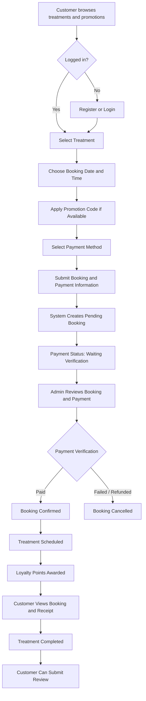
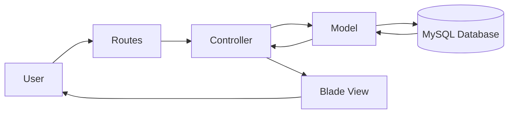

<div align="center">

# Lumiere Beauty

### Beauty Treatment Booking & Management System

A web-based information system designed to support beauty treatment booking, scheduling, simulated payments, promotions, loyalty points, reviews, and administrative management.

**Academic Project — Web Programming**

<br>


</div>

---

## Overview

**Lumiere Beauty** is a web-based beauty treatment booking and management system developed as an academic project for the **Web Programming** course.

The system provides a centralized platform where customers can explore available beauty treatments and promotions, schedule treatments, complete a simulated payment process, monitor their bookings, collect loyalty points, and submit reviews.

An administrative interface is also provided to manage treatments, promotions, customer bookings, payment statuses, and treatment progress.

---

## Problem Background

Beauty service businesses require an organized process for managing treatment information, reservations, schedules, promotions, payments, and customer records.

When these activities are handled separately or manually, customers may experience difficulties in checking available services, arranging treatment schedules, and tracking their reservations.

**Lumiere Beauty** was designed to demonstrate how a web-based information system can integrate these activities into a more structured and centralized digital workflow.

---

## Project Objectives

The project aims to:

- Provide easy access to beauty treatment and promotion information.
- Support an integrated treatment booking and scheduling process.
- Centralize booking and simulated payment information.
- Allow customers to monitor booking history and payment status.
- Implement a loyalty points and membership mechanism.
- Allow customers to provide reviews after completing treatments.
- Provide administrators with tools to manage treatments, promotions, and bookings.
- Apply Laravel-based web development and relational database concepts in a complete information system.

---

## User Roles

### Customer

Customers can:

- Register and log in to the system.
- Browse available beauty treatments.
- View active promotions.
- Select a treatment and preferred schedule.
- Choose a simulated payment method.
- Submit payment information.
- Monitor booking and payment status.
- View booking history.
- Access payment receipts.
- Monitor loyalty points and membership information.
- Manage profile information.
- Submit reviews after treatment completion.

### Administrator

Administrators can:

- Access the administrative dashboard.
- Create, update, and manage treatment information.
- Activate or deactivate treatments.
- Manage promotional programs.
- Monitor customer bookings.
- Search and filter booking information.
- Verify and update payment status.
- Update booking status.
- Update treatment progress.

---

## Core Business Flow



### Flow Summary

1. The customer browses available treatments and promotions.
2. The customer logs in or creates an account before booking.
3. The customer selects a treatment, date, time, promotion, and payment method.
4. The system stores the booking with a **pending** status and the payment as **waiting for verification**.
5. The administrator reviews the booking and payment information.
6. When payment is marked as **paid**, the booking is automatically confirmed and the treatment is scheduled.
7. The customer receives loyalty points after successful payment verification.
8. After the treatment is completed, the customer can submit a review.
9. Failed or refunded payments result in cancellation of the booking.

---

## Key Features

| Feature | Customer | Administrator |
|---|:---:|:---:|
| User Registration & Login | ✅ | ✅ |
| Browse Treatments | ✅ | ✅ |
| View Promotions | ✅ | ✅ |
| Treatment Booking | ✅ | — |
| Schedule Selection | ✅ | — |
| Simulated Payment | ✅ | — |
| Booking History | ✅ | — |
| Payment Receipt | ✅ | — |
| Loyalty Points | ✅ | — |
| Membership Information | ✅ | — |
| Customer Reviews | ✅ | — |
| Treatment Management | — | ✅ |
| Promotion Management | — | ✅ |
| Booking Management | — | ✅ |
| Payment Verification | — | ✅ |
| Treatment Status Management | — | ✅ |

---

## Simulated Payment

Lumiere Beauty includes a **simulated payment workflow** to demonstrate the booking and payment process.

Supported payment options include:

- QRIS
- Bank Transfer
- E-Wallet
- Cash

The system stores booking and payment information and allows administrators to update the payment status during the verification process.

> **Disclaimer:** All payment information used in this project is dummy data. No real payment gateway or real financial transaction is implemented.

---

## Promotion & Loyalty System

The system supports promotional discounts and customer loyalty features.

Customers can:

- View available promotions.
- Apply eligible promotional codes during booking.
- Receive loyalty points after payment is successfully verified.
- Monitor point transaction history.
- View their current membership information.

---

## Review System

Authenticated customers can submit ratings and comments for supported services.

For booking-related reviews, the system verifies that:

- The booking belongs to the currently authenticated customer.
- The treatment has already been completed.

Ratings are limited to a scale of **1–5**.

---

## Technology Stack

| Category | Technology |
|---|---|
| Backend Framework | Laravel 10 |
| Programming Language | PHP 8.1+ |
| Frontend | Blade Template, HTML, CSS |
| UI Framework | Bootstrap 5 |
| Database | MySQL |
| Build Tool | Vite |
| Package Management | Composer, NPM |
| Version Control | Git & GitHub |
| Local Development | XAMPP |

---

## System Architecture

Lumiere Beauty follows Laravel's **Model-View-Controller (MVC)** architecture.



### Architecture Components

- **Routes** handle incoming application requests.
- **Controllers** manage application and business logic.
- **Models** interact with application data.
- **MySQL** stores user, treatment, booking, payment, promotion, point, and review information.
- **Blade Views** provide the customer and administrator interfaces.

---

## Screenshots

Screenshots of the main customer and administrator workflows will be added after the project documentation is prepared.

Planned documentation includes:

- Homepage
- Treatment Catalogue
- Booking Process
- Payment Process
- My Bookings
- Loyalty Points
- Admin Dashboard
- Booking Management

---

## Local Installation

### Requirements

Make sure the following software is installed:

- PHP 8.1 or later
- Composer
- MySQL
- Node.js & NPM
- Git

### 1. Clone the Repository

```bash
git clone https://github.com/anggitasilmyy/lumiere-beauty.git
cd lumiere-beauty
```

### 2. Install PHP Dependencies

```bash
composer install
```

### 3. Install Frontend Dependencies

```bash
npm install
```

### 4. Create Environment File

```bash
cp .env.example .env
```

For Windows users, `.env.example` can also be manually duplicated and renamed to `.env`.

### 5. Generate Application Key

```bash
php artisan key:generate
```

### 6. Configure the Database

Update the database configuration inside `.env`:

```env
DB_DATABASE=lumiere_beauty
DB_USERNAME=root
DB_PASSWORD=
```

Adjust the database username and password according to your local MySQL configuration.

### 7. Run Database Migration

```bash
php artisan migrate
```

### 8. Run the Frontend Development Server

```bash
npm run dev
```

### 9. Run the Laravel Application

Open another terminal and run:

```bash
php artisan serve
```

The application will be available locally at:

```text
http://127.0.0.1:8000
```

> Database seeding instructions will be added after the demo administrator configuration is separated from production credentials.

---

## Security & Demo Data

This repository is intended for **academic and portfolio purposes**.

- Production environment credentials should not be stored in this repository.
- The `.env` file is excluded from version control.
- Payment information included in the application is dummy data.
- No real financial transactions are processed.
- Demo administrator credentials must be separated from production administrator credentials.

---

## Academic Context

This project was developed as part of a **Web Programming course project** in the Information Systems program at **Universitas Esa Unggul**.

The project applies concepts including:

`Laravel MVC` · `Routing` · `Authentication` · `CRUD Operations` · `Database Integration` · `Role-Based Access` · `Booking Workflow` · `Payment Workflow`

The main objective of the project is to demonstrate the implementation of a complete web-based information system that integrates customer-facing functionality with administrative management.

---

## 👩🏻‍💻 Project Team

This project was developed as a group academic project by:

- **Silmy Kaffa Anggita**
- **Angellica Ivana**
- **Neng Audy Agustin**
- **Stefanie Sentana**
- **Nova Selvia**

---

## Repository Owner

### Silmy Kaffa Anggita

Information Systems Student — Universitas Esa Unggul

[LinkedIn](https://www.linkedin.com/in/silmy-kaffa-anggita-1347a6322) · [GitHub](https://github.com/anggitasilmyy)

---

<div align="center">

### Lumiere Beauty

**Beauty Treatment Booking & Management System**

*Academic Web Programming Project*

</div>
